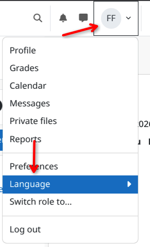
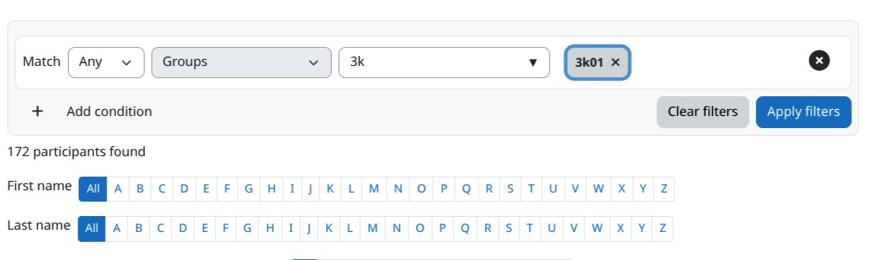
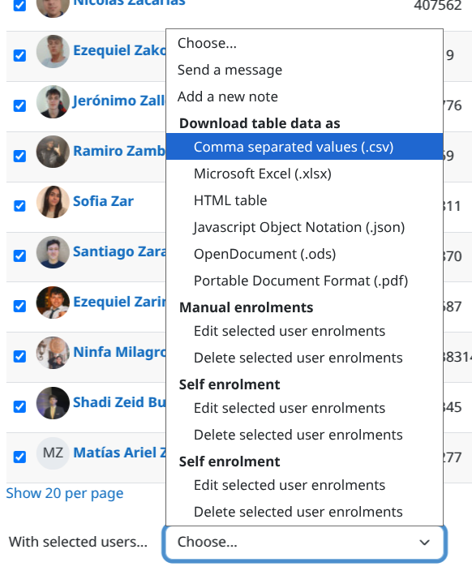
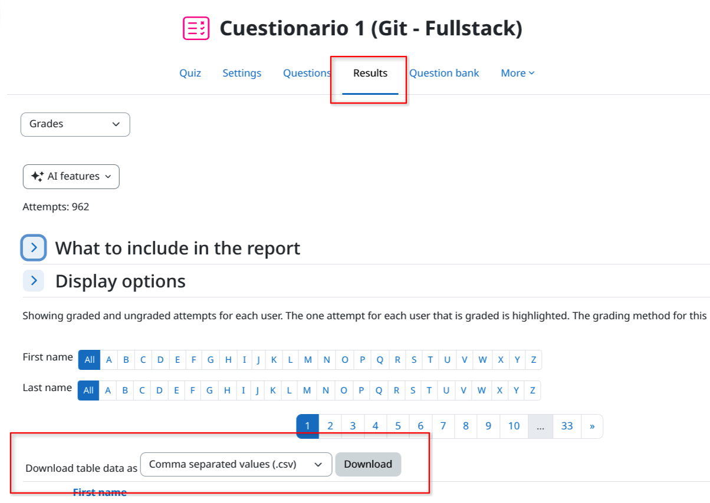
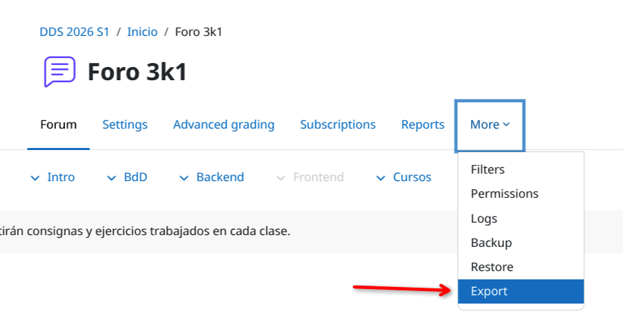
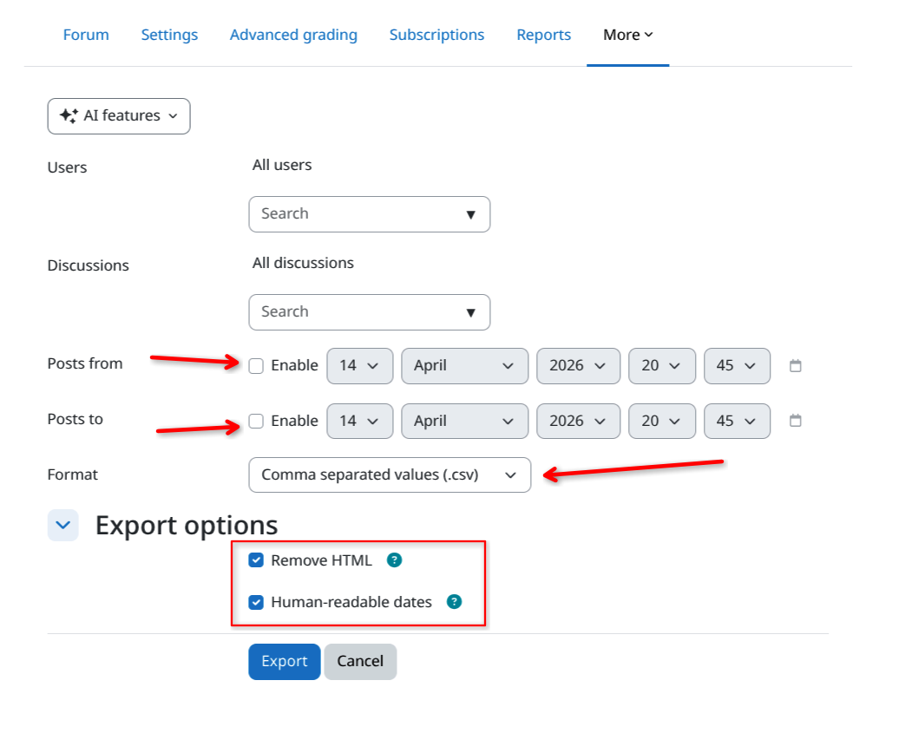
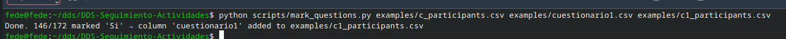
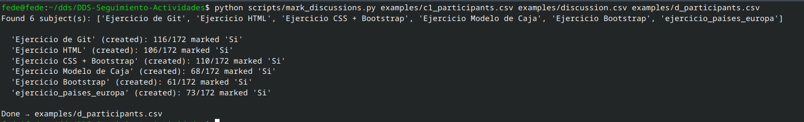

> [!CAUTION]
> Esta guía fue migrada y recibirá nuevas actualizaciones en: https://git.ffede.ar/fede/DDS-Seguimiento-Actividades

# Guía de Scripts - DDS Seguimiento de Actividades

El siguiente README.md, juntos con sus archivos, propone establecer una pequeña guía para el uso de los scripts, inclyendo:
- Los respectivos scripts para el uso
- CSV de ejemplo para poder visualizar la estructura de datos que se obtiene de Moodle
- Una guía paso a paso de como utilizar cada script

# 1. Obteniendo los distintos archivos CSV

> [!CAUTION]
> Es importante resaltar que el Moodle **debe estar en Inglés**. Moodle traduce las columnas si este está en español, pero los scripts trabajan con los valores en inglés. Esto aplica para **todos** los archivos CSV que se vayan a exportar desde Moodle.

> 

## 1.1. Archivo CSV de inscriptos (también lo llamaremos: base de conocimiento, source file)

Para obtener el archivo de participantes, nos debemos digir al `Curso > Participantes`. Agregamos filtro por `grupo`, seleccionamos la comisión, aplicamos filtros.



Bajamos hasta el final de la página, hacemos clic en `Seleccionar todas las cuentas` y luego en el dropdown de `Con usuarios seleccionados...` la opción `Valores separados por comas (.csv)`



> Se puede encontrar un ejemplo de lo exportado dentro en [examples/c_participants.csv](examples/c_participants.csv)

## 1.2. Archivo CSV de cuestionarios

Para obtener el archivo CSV de los cuestionarios/pregunteros, solo es necesario en la tarea ir a `Intentos` (en la parte inferior) o `Resultados` (en la parte superior) y descargar la tabla de datos como .csv



> Se puede encontrar un ejemplo de lo exportado dentro en [examples/cuestionario1.csv](examples/cuestionario1.csv)

## 1.3. Archivo CSV de los foros

Para obtener el archivo CSV de los foros de discusión, nos dirigimos al foro que queremos exportar, clic en `More > Export`



Una vez dentro, desactivamos `Posts from` y `Posts to`, nos aseguramos que el formato sea .csv, y activamos ambas `Export options`



Finalmente exportamos.

> Se puede encontrar un ejemplo de lo exportado dentro en [examples/discussion.csv](examples/discussion.csv)

# 2. Usando los scripts

Todos los scripts se pueden encontrar dentro de la carpeta [/scripts](scripts) dentro de este repositorio. :smile:

## 2.1. Script: mark_questions.py

El script [mark_questions.py](scripts/mark_questions.py) está destinado a editar el source file (o generar uno nuevo) para agregar una nueva columna con el nombre del archivo del preguntero o cuestionario.

> [!TIP]
> Es recomendable (o más fácil en todo sentido) editar el nombre del archivo CSV del cuestionario con el nombre que le queramos dar a la columna en nuestro source file, dado por el hecho de que Moodle exporta los CSV con nombres bastantes largos.

### 2.1.1. Uso
```
python mark_questions.py <source_file.csv> <questions_file.csv> [output.csv]
```

Donde: 
- `source_file.csv`: Es nuestra base de conocimiento, es decir, la lista de participantes que se obtuvo desde Moodle.
- `questions_file.csv`: Es el archivo CSV del cuestionario/preguntero obtenido desde Moodle.
- (Opcionalmente) `output.csv`: Podemos especificar el nombre del archivo a crear para no sobreescribir nuestro source file si es que así lo deseamos.

En su uso correcto, el script va a indicar que el marcado fue correcto, que se matchearon n cantidad con "Si" y que se añadió la nueva columna con los respectivos valores al source file u output file, si fue especificado.



> El respectivo output se puede encontrar en [examples/c1_participants.csv](examples/c1_participants.csv)

## 2.2. Script: mark_discussions.csv

El script [mark_discussions.py](scripts/mark_discussions.py) está destinado a editar el source file (o generar uno nuevo) para agregar una nueva columna (o editar las ya existentes) por cada "subject" distinto del foro.

### 2.2.1. Uso
```
python mark_discussions.py <source.csv> <discussion.csv> [output.csv]
```

Donde:
- `source_file.csv`: Es nuestra base de conocimiento, es decir, la lista de participantes que se obtuvo desde Moodle.
- `discussion.csv`: Es el archivo CSV del foro obtenido desde Moodle.
- (Opcionalmente) `output.csv`: Podemos especificar el nombre del archivo a crear para no sobreescribir nuestro source file si es que así lo deseamos.

> [!CAUTION]
> Debido a que Moodle cuando exporta los foros, el userId que exporta es el ID interno de Moodle, y no los legajos... el script **une** los nombres del source file, para luego comparar contra el `userfullname`. Estamos propensos a errores...

> [!NOTE]
> Y como información extra con respecto a la nota de arriba, y volviendo a recordar, todos los archivos obtenidos desde Moodle **deben estar en inglés**, es decir, al momento de exportar **debemos cambiar el idioma de Moodle a inglés**, si es que la utilizamos en español.

En su uso correcto, el script va a indicar que `subjects` encontró, si las creo o editó, y cuantos match hubo con respecto al source file.



> El respectivo output se puede encontrar en [examples/d_participants.csv](examples/d_participants.csv)
